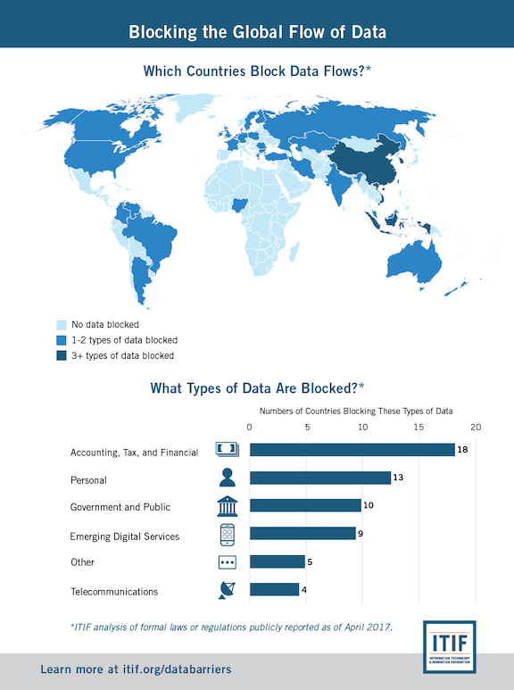
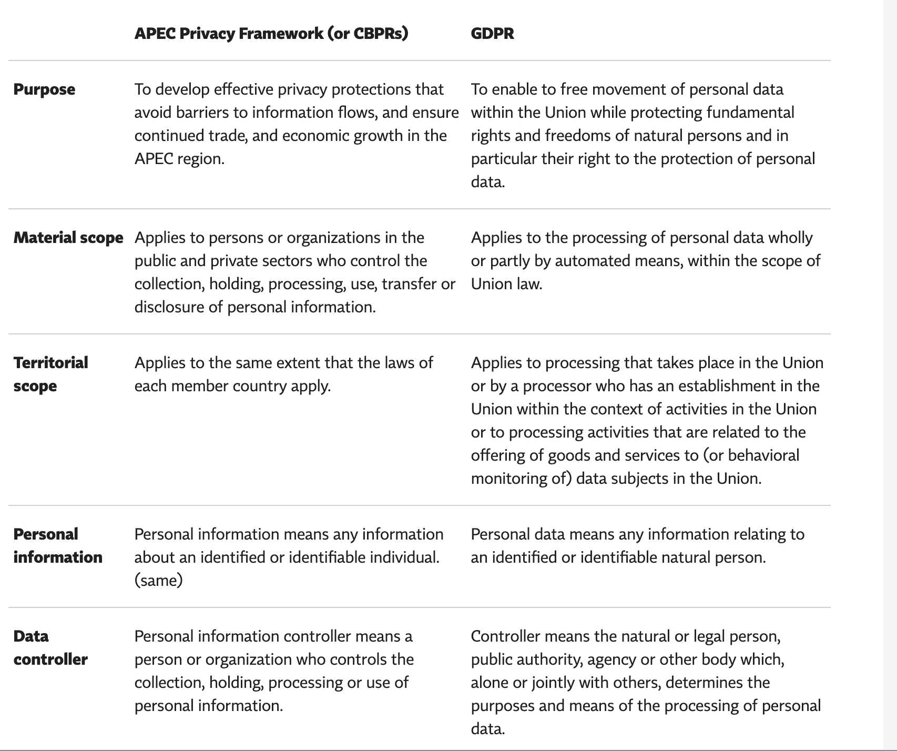

# Cross-Border Data Flows & Privacy

Global economy depends on the transfer of data and most governments recognize

> “the economic and social benefits of protecting the personal information of users of digital trade”.

**Cross-border Data Transfers (CBDT)** usually means personal data collected from one location are transferred to a third country or international organization. CBDT restrictions fall into two general categories:

1. *Privacy Regulations*: the process subject to compliance with set conditions, including conditions for onward transfer. Once conditions are met, transfers are allowed. It typically involves matters like, [Top 10 operational impacts of the GDPR: Part 4 - Cross-border data transfers][1].

* Data subject consent
* Data anonymization
* Breach notification
* trans-border data transfers
* Appointment data protection officers
  * one government agency with enforcement authority
  * one third-party accountability agent

2. *Data Localization*: ban on transferring data out of the country or require the organization to build or use local infrastructure and servers.

### Cross-Border Privacy Rules

Regulations and policies regarding CBDT are varied depending on where the data come from and go to. The types of data also matter in this case. For example,

* The EU GDPR allows personal data transfers to a third country only if a set of conditions are fulfilled.
* The United States-Mexico-Canada Agreement (USMCA) promotes cross-border data flows with some conditions as well.
* The Asia-Pacific Economic Cooperation (APEC) Privacy Framework established a principles-based model for national privacy laws that recognized the importance of 

> effective privacy protections that avoid barriers to information flows.

Within which, each APEC member was encouraged to implement their domestic privacy laws based on the principles in this framework.

## When CBDT Happens?

Surprisedly, in many situations CBDT occurs. For example,

* Coorperate emails, customer communications.
* Data analysis to optimize global logistics.
* Outsource customer support services.
* HR for global workforces.
* Global researches.
* Use Internet to query, post or update information locating overseas.

There are other unexpected situations, for example, accidental or intentional data breaches.

## Some Case Studies

### Germany

### Other EU Countries: General Data Protection Regulation (GDPR)

[GDPR](https://gdpr-info.eu) contains a single set of rules for protecting the personal data of all European Union (EU) residents plus *visitors*. GDPR also provides strict law protecting data transfering accross borders, including significant fines and penalties for non-compliant data controllers and processors. It has been updating new protections until 2018, especially focusing on EU citizens’ data. For more details, check [GDPR Articles 44, and 45 – 49](https://gdpr-info.eu/art-44-gdpr), which lays out conditions data can be transferred beyond EU/EEA.

### Canada and Mexico

In 2018 the U.S., Mexico and Canada announced a new trade agreement *USMCA*, which is built on a chapter on digital trade from APEC Cross-Border Privacy Rules (“APEC CBPRs”), aims to

> “adopt or maintain a legal framework that provides for the protection of the personal information of the users.

USMCA formally recognizes the “APEC CBPRs” within their respective legal systems. [3]

### Asian
The [APEC Cross-Border Privacy Rules](http://cbprs.org) (“APEC CBPRs”) System is developed by the **21** APEC member economies as a cross-border transfer mechanism and comprehensive privacy program for private sector organizations  to enable the accountable free flow of data across the APEC region. The CBPR system has now been formally joined by the United States, Canada, Japan and Mexico.

#### Comparison of CBPRs and GDPR

### The rest of the world

## Data Localization
On the other extreme side, banning data transfers, is called **Data localization** or **data residency**, which regulates means data about a nations' citizens or residents be collected, processed or stored inside the country. The requirement for localization increased after the incident by ex CIA - *Edward Snowden*, who leaked highly classified information from NSA in 2013. Also goverments in Europe and across the world are starting to realize the perils brought by data flow through technology. The emerging trend is becoming to enforce data are consumed on the spot before serve upper applications. Germany and France are the first to approve data localization laws, following by EU in 2017.

### DL Laws are Highly Regional
Each country could have its own laws for diffent types of data. For example, Australia regulates its health records, Canada restricts personal data from public service providers, and China restricts more including personal, business, and financial data. [Data localization][2]

## GDRP 

## Reference
[1] [Top 10 operational impacts of the GDPR: Part 4 - Cross-border data transfers](https://iapp.org/news/a/top-10-operational-impacts-of-the-gdpr-part-4-cross-border-data-transfers/)
[2] [Data localization](https://en.wikipedia.org/wiki/Data_localization)
[3] [APEC Cross-Border Privacy Rules Enshrined in U.S.-Mexico-Canada Trade Agreement](https://www.huntonprivacyblog.com/2018/10/03/apec-cross-border-privacy-rules-enshrined-u-s-mexico-canada-trade-agreement)
