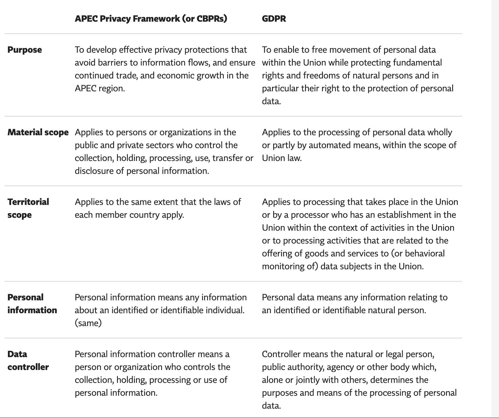
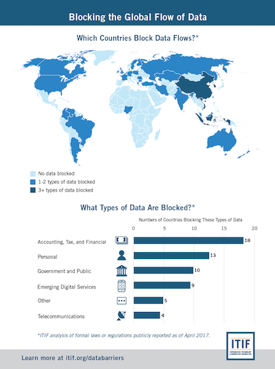

## Cross-Border Data Transfers & Privacy

### By Anne Yu | March 31, 2019

Cross-border Data Transfers (CBDTs)
:  *Personal data* collected from one location are transferred to a third country or international organization. 

Nowadays global economy depends on CBDTs. From my investigation modern governments recognize,
> . importance of moving data freely to wherever those data are needed. 
> . the economic and social benefits of protecting the personal information of users of digital trade.

But there is also a trend for countries to restrict the data exchange and make data localized.

CBDTs restrictions fall into **two** general categories:

1. *Privacy Regulations*: the transfer process subject to compliance with a set of conditions, including conditions for onward transfer. Once conditions are met, transfers are allowed. It typically covers a variety of matters [1], if being overlooked or jepardized, operators will be imposed with legal and civil obligations.

* Data subject consent
* Data anonymization
* Breach notification
* Appointment data protection officers
  * one government agency with enforcement authority
  * one third-party accountability agent

2. *Data Localization*: ban on transferring data out of the country, or require the organization to build or use local infrastructure and servers.

### Cross-Border Privacy Regulations

CBDTs rule and policy are varied depending on where the data come from and go to. The type of data also matter in this case. For example,

* The EU GDPR generally prohibites CBDTs of personal data outside of EU territory, unless to a third country with a set of conditions are fulfilled.
* The USMCA promotes cross-border data flows with less strict conditions as well.
* The APEC CBPRs established a principles-based model for national privacy laws that recognized the importance of 

> effective privacy protections that avoid barriers to information flows.

Within which, each APEC member was encouraged to implement their domestic privacy laws based on the principles in this framework, which seems less strict.

* Other countries, like China, South Korean might have even stricker rules.

### When CBDTs Happens?

Surprisedly, CBDTs occurs in many daily occasions. For example,

* Coorperate emails, customer suppport communications.
* Data analysis to optimize global logistics.
* Outsource services.
* HR for global workforces.We will discuss each of these cases using examples.
* Conduct global researches.
* Use Internet to query, post or update information locating overseas.

There are other unexpected situations, for example, accidental or intentional data breaches.

### Some Case Studies

Overall, one can query [dlapiperdataprotection.com](https://www.dlapiperdataprotection.com/index.html?t=transfer&c=RU&c2=) for a better understanding. The service can also be used to compare laws from two countries side by side.

#### European Union (EU) Countries: General Data Protection Regulation (GDPR)

[GDPR](https://gdpr-info.eu) contains a set of rules for protecting the personal data of all EU residents plus *visitors*. GDPR also provides strict law protecting data transfering accross borders, including significant fines and penalties for non-compliant data controllers and processors. It has been updating new protections until 2018, especially focusing on EU citizens’ data. For more details, check [GDPR Articles 44, and 45 – 49](https://gdpr-info.eu/art-44-gdpr), which lays out conditions data can be transferred beyond EU/EEA.

#### Canada and Mexico (USMCA)

In 2018 the U.S., Mexico and Canada announced a new trade agreement *United States-Mexico-Canada Agreement (USMCA)*, which is built on a chapter on digital trade from APEC Cross-Border Privacy Rules (APEC CBPRs), aims to

> “adopt or maintain a legal framework that provides for the protection of the personal information of the users.

USMCA formally recognizes the “APEC CBPRs” within their respective legal systems. [2]

#### Asian (APEC CBPRs)

The [APEC CBPRs](http://cbprs.org) system is developed by the **21** APEC member economies as a cross-border transfer mechanism and comprehensive privacy program for private sector organizations to enable the accountable free flow of data across the APEC region. The APEC CBPRs system has now been formally joined by the United States, Canada, Japan and Mexico.

#### Comparison of CBPRs and GDPR

### The rest of the world

With most countries following either GDPRs or APEC CBPRs there are still some countries imposing their own systems to regulate stricker on CBDTs.

#### Rusian

Russian enacted *Data protection (privacy) Laws* to permit CBPRs as long as operator ensures that the recipient state provides adequate protection of personal data. 

#### China
In 2017, *Cybersecurity Law of the People's Republic of China* (CSL) was published including policies invovling cross-border data transfer. It is much stricker [3]. In general, 

> it requires Critical Information Infrastructure (CII) to localize data within the territory of China and all network operators to conduct security assessments prior to the data export.

#### South Korean
It is *stricker* as well with new constraints on CBDTs. In March 2019 **Amendments to IT Networks Act** took effect. The most important point is that it imposes to appoint a local agent responsible for Korean data privacy compliance regarding CBPRs [4].

## Data Localization
On the other extreme side, banning data transfers, is called 

Data Localization or Data Residency

:  which regulates means data about a nations' citizens or residents be collected, processed or stored inside the country. The requirement for localization has been increased after the incident of ex CIA - *Edward Snowden*, who leaked highly classified information from NSA in 2013. Also goverments in Europe and across the world are starting to realize the perils brought by data flow through technology. The emerging trend is becoming to enforce data are consumed on the spot before serve upper applications. Germany and France are the first to approve data localization laws, following by EU in 2017.

### Data Types Matter as well
Each country could have its own laws for diffent types of data. For example, Australia regulates its health records, Canada restricts personal data from public service providers, and China restricts more including personal, business, and financial data [5].

## Reference
[1] [Top 10 operational impacts of the GDPR: Part 4 - Cross-border data transfers](https://iapp.org/news/a/top-10-operational-impacts-of-the-gdpr-part-4-cross-border-data-transfers/)

[2] [APEC Cross-Border Privacy Rules Enshrined in U.S.-Mexico-Canada Trade Agreement](https://www.huntonprivacyblog.com/2018/10/03/apec-cross-border-privacy-rules-enshrined-u-s-mexico-canada-trade-agreement)

[3][China: New Challenges Ahead: How To Comply With Cross-Border Data Transfer Regulation In China](http://www.mondaq.com/china/x/700140/Data+Protection+Privacy/New+Challenges+Ahead+How+To+Comply+With+CrossBorder+Data+Transfer+Regulation+In+China)

[4][Korean data law amendments pose new constraints for cross-border online services and data flows](https://www.lexology.com/library/detail.aspx?g=54354cd0-fc48-4a1a-b2b6-8adb1087b4a2)

[5] [Data localization](https://en.wikipedia.org/wiki/Data_localization)

*[GDPR]: General Data Protection Regulation

*[CBDTs]: Cross-border Data Transfers

*[EU]: European Union

*[APEC]: Asia-Pacific Economic Cooperation Apec

*[APEC CBPRs]: APEC Cross-Border Privacy Rules

*[USMCA]: United States-Mexico-Canada Agreement
